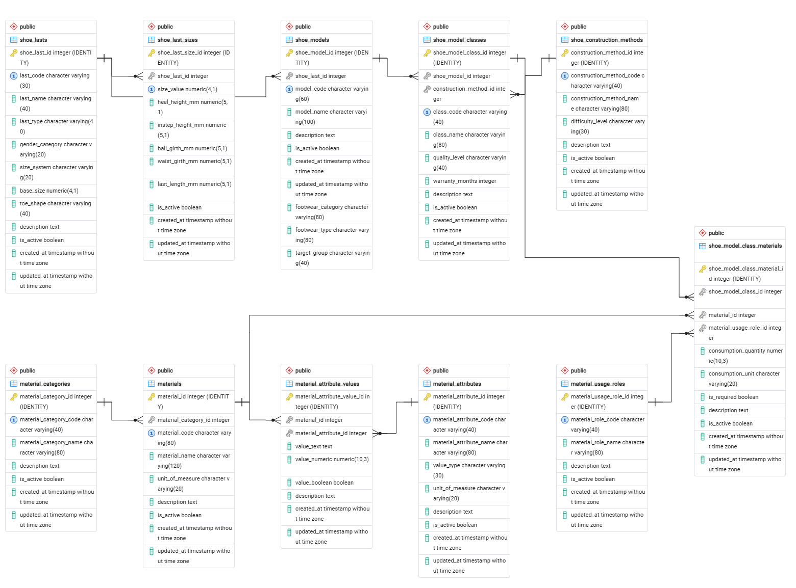

# FootwearProductionCore

**FootwearProductionCore** is a PostgreSQL database project that models the core production domain of footwear manufacturing.

The database represents shoe lasts and their sizing parameters, footwear models, construction methods, production materials, material properties and usage roles, as well as production standards for individual model variants.

The project is designed so that the material and model catalog can be expanded primarily through data and relationships rather than through repeated changes to the database structure.

## Key Features

The project includes:

* a catalog of shoe lasts and their sizing parameters;
* footwear models classified by category, type, and target group;
* a reference catalog of footwear construction methods;
* a unified catalog of production materials;
* material categories;
* an extensible material attribute system;
* material usage roles;
* model classes representing production standards for specific model variants;
* material composition for each model class, including usage role, consumption quantity, and mandatory usage rules;
* foreign keys and constraints for maintaining data integrity;
* seed data for deploying a working demonstration database;
* a set of 9 demonstration SQL queries covering the main relationships and query scenarios.

## Database Architecture

The database consists of 11 tables organized into four functional areas.

### Shoe Lasts

* `shoe_lasts`
* `shoe_last_sizes`

### Construction Methods

* `shoe_construction_methods`

### Materials

* `material_categories`
* `material_attributes`
* `material_usage_roles`
* `materials`
* `material_attribute_values`

### Footwear Models

* `shoe_models`
* `shoe_model_classes`
* `shoe_model_class_materials`

The central production configuration is the model class (`shoe_model_classes`), which associates a footwear model with a construction method and its own material composition.

Materials are stored independently from footwear models and can be reused across different model classes in different production roles.

A detailed description of the architecture, entities, and relationships is available in the [Project Documentation](docs/project_documentation.md).

## Entity-Relationship Diagram



The ERD represents the current database structure and the relationships between all 11 tables.

## Project Structure

```text
footwear-production-core/
├── database/
│   ├── ddl/
│   │   └── 01_reference_tables.sql
│   ├── schema_migrations/
│   │   └── 001_update_shoe_models_classification_fields.sql
│   ├── data_migrations/
│   │   └── 001_add_padding_material_category.sql
│   ├── dml/
│   │   └── 01_seed_data.sql
│   └── queries/
│       └── 01_demo_queries.sql
│
├── docs/
│   ├── erd/
│   │   └── schema.png
│   ├── database_deployment_guide.md
│   └── project_documentation.md
│
├── .gitignore
└── README.md
```

## Database Deployment

To perform a clean deployment, create an empty PostgreSQL database and execute the SQL files in the following order:

1. `database/ddl/01_reference_tables.sql`
2. `database/schema_migrations/001_update_shoe_models_classification_fields.sql`
3. `database/data_migrations/001_add_padding_material_category.sql`
4. `database/dml/01_seed_data.sql`
5. `database/queries/01_demo_queries.sql` — for demonstration and verification

The migration files preserve the evolution of the project structure. The initial DDL schema is therefore migrated to the current structure before the current seed data is loaded.

The complete deployment procedure is documented in the [Database Deployment Guide](docs/database_deployment_guide.md).

The deployment process was verified against a separate clean PostgreSQL database: the schema, both migrations, and seed data were applied successfully, after which all 9 demonstration queries executed without errors.

**Tested with PostgreSQL 18.3.**

## Demonstration Queries

The `database/queries/01_demo_queries.sql` file contains 9 queries that demonstrate the main parts of the data model.

They cover scenarios such as:

* retrieving the available sizes for a specific shoe last;
* identifying relationships between footwear models and shoe lasts;
* analyzing model classes;
* determining the construction method used by a model class;
* retrieving the material composition of a specific model class;
* identifying the production role of each material;
* working with material categories and attributes;
* tracing relationships between the main production entities.

## Data Integrity

Data integrity is enforced through PostgreSQL constraints:

* primary keys identify records;
* foreign keys enforce relationships between entities;
* unique constraints prevent duplication of key business values;
* check constraints restrict allowed values for selected fields;
* required fields and relationships are enforced through `NOT NULL`;
* many-to-many and other extensible relationships are implemented through association tables.

The architecture separates reference data, production entities, and their relationships, reducing duplication and allowing the system to evolve without repeatedly restructuring the core schema.

## Technologies

* PostgreSQL
* PostgreSQL SQL
* Git
* Markdown
* pgAdmin

## Documentation

Additional project resources:

* [Project Documentation](docs/project_documentation.md) — detailed description of the architecture, tables, relationships, production logic, and architectural considerations;
* [Database Deployment Guide](docs/database_deployment_guide.md) — clean database deployment procedure;
* [ERD](docs/erd/schema.png) — visual representation of the database entities and relationships.

## Project Status

**Completed**

The current version represents a completed footwear production database core and can be deployed from scratch using the files included in the repository.
